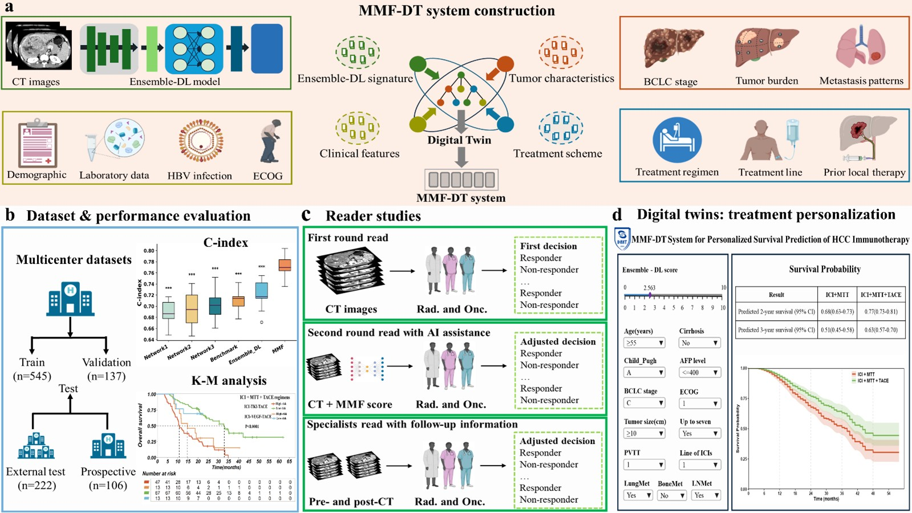

# A Multimodal Fusion Digital Twin System for Personalized Immunotherapy Management in Unresectable Hepatocellular Carcinoma

## Overview
<div style="text-align:justify">
Management of unresectable hepatocellular carcinoma (HCC) is complicated by substantial inter-patient variability in response to immunotherapy. To address the critical need for personalized treatment guidance, we developed MMF-DT—a Multimodal Fusion Digital Twin system that synergizes ensemble deep learning with digital twin modeling. By integrating CT imaging, clinical, tumor, and treatment data, MMF-DT constructs a patient-specific virtual counterpart to simulate individualized survival trajectories and generate tailored treatment recommendations. In multicenter retrospective and prospective cohorts, MMF-DT achieved a concordance index (C-index) of 0.77–0.80 for overall survival (OS), surpassing conventional benchmarks. In reader studies, it outperformed physicians (area under the curve [AUC]: 0.85–0.88 vs. 0.52–0.74, P < 0.01), enhancing physician accuracy by up to 35.2% and inter-reader agreement by 128.0%. These recommendations correlated with prolonged OS and progression-free survival(PFS). MMF-DT demonstrates that integrating multimodal data with digital twin technology enables accurate prognostication and personalized immunotherapy management in unresectable HCC.

</div>



## 1. Environmental settings

Please follow the guide to install and set up the project.

```bash
# Clone the repository
git clone https://github.com/wtf633/MMF-DT.git

# Create conda environment
conda env create -f environment.yml
conda activate your_environment_name
```

## 2. Download Datasets

Data related to this study, including de-identified participant data with the accompanying data dictionary, original CT images, study protocol, and statistical analysis plan, will be made available to the scientific community upon publication. Requests for these data should be directed to the corresponding authors and must be reasonable. A signed data use agreement and institutional review board approval will be required before the release of any research data.

## 3. Training & Evaluate
Using the scripts on scripts directory to train and evaluate the model.

```
sh ./scripts/run_effnet.sh
sh ./scripts/run_ae.sh
sh ./scripts/run_m3t.sh
```

## 4. RSF-Based Ensemble Signature
To obtain a robust imaging signature, risk vectors from the three deep learning models were fused using a Random Survival Forest (RSF) instead of simple averaging. Trained with survival data, the RSF generated out-of-bag predictions that served as the final Ensemble-DL signature.

```
python RandomSurvivalForest.py
```

## 5. Digital Twin System
The MMF-DT system has been integrated into an interactive online application, freely accessible at https://zlzhang1124.shinyapps.io/InteractiveMedicalPredictionAPP/.

```
app_digital_twins.R
```
